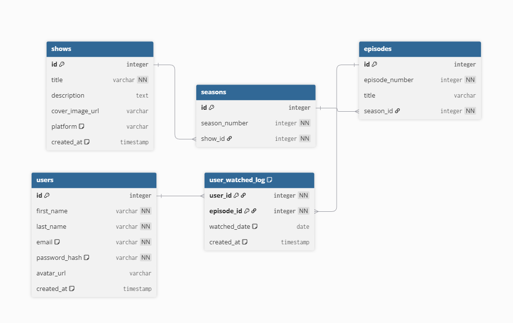

# Entity Relationship Diagram

Reference the Creating an Entity Relationship Diagram final project guide in the course portal for more information about how to complete this deliverable.

## Create the List of Tables

- `users`
- `shows`
- `seasons`
- `episodes`
- `user_watched_log` (Join Table)

## Add the Entity Relationship Diagram

Here is the visual diagram for the database. A detailed breakdown of each table is included below.

---

### `users`

This table stores information for each registered user.

| Column Name     | Type      | Description                         |
| --------------- | --------- | ----------------------------------- |
| `id`            | integer   | **Primary Key**                     |
| `first_name`    | varchar   | User's first name                   |
| `last_name`     | varchar   | User's last name                    |
| `email`         | varchar   | User's login email (must be unique) |
| `password_hash` | varchar   | Hashed password for security        |
| `avatar_url`    | varchar   | (Optional) URL for profile picture  |
| `created_at`    | timestamp | Date the account was created        |

### `shows`

This table stores the top-level information for a show or movie.

| Column Name       | Type      | Description                             |
| ----------------- | --------- | --------------------------------------- |
| `id`              | integer   | **Primary Key**                         |
| `title`           | varchar   | Title of the show/movie                 |
| `description`     | text      | Summary of the show                     |
| `cover_image_url` | varchar   | URL for cover art                       |
| `platform`        | varchar   | e.g., "Netflix", "Crunchyroll"          |
| `created_at`      | timestamp | Date the show was added to the database |

### `seasons`

This table stores the individual seasons for a specific show.

| Column Name     | Type    | Description                           |
| --------------- | ------- | ------------------------------------- |
| `id`            | integer | **Primary Key**                       |
| `season_number` | integer | The order of the season (1, 2, 3...)  |
| `show_id`       | integer | **Foreign Key** (links to `shows.id`) |

### `episodes`

This table stores the individual episodes for a specific season.

| Column Name      | Type    | Description                             |
| ---------------- | ------- | --------------------------------------- |
| `id`             | integer | **Primary Key**                         |
| `episode_number` | integer | The order of the episode (1, 2, 3...)   |
| `title`          | varchar | Title of the episode                    |
| `season_id`      | integer | **Foreign Key** (links to `seasons.id`) |

### `user_watched_log`

This is the join table that tracks which user has watched which episode. This forms the core **many-to-many** relationship.

| Column Name    | Type      | Description                                                          |
| -------------- | --------- | -------------------------------------------------------------------- |
| `user_id`      | integer   | **Composite Primary Key** & **Foreign Key** (links to `users.id`)    |
| `episode_id`   | integer   | **Composite Primary Key** & **Foreign Key** (links to `episodes.id`) |
| `watched_date` | date      | **Custom Feature:** Date the user watched the episode                |
| `created_at`   | timestamp | Date this log entry was created                                      |
